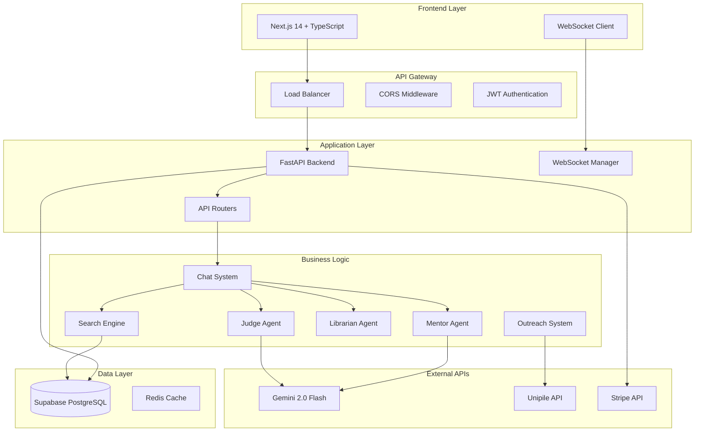

# 🏗️ DOCUMENTACIÓN TÉCNICA PARA CTO - 0BULLSHIT PLATFORM

## 🎯 EXECUTIVE SUMMARY

0Bullshit es una plataforma SaaS B2B que utiliza IA multiagente para automatizar el proceso de fundraising de startups. La arquitectura actual está construida sobre FastAPI/Python con Supabase como base de datos, integrando Gemini 2.0 Flash para procesamiento de lenguaje natural y Unipile para automatización de outreach en LinkedIn.

### 📊 MÉTRICAS TÉCNICAS ACTUALES
- **Backend:** FastAPI (Python 3.8+)
- **Base de datos:** Supabase (PostgreSQL)
- **IA:** Google Gemini 2.0 Flash
- **Real-time:** WebSockets nativo
- **Deployment:** Render.com
- **Arquitectura:** Microservicios modulares

---

## 🏗️ ARQUITECTURA DEL SISTEMA

### 📐 DIAGRAMA DE ARQUITECTURA



### 🔧 STACK TECNOLÓGICO DETALLADO

#### **Backend Core**
```yaml
Framework: FastAPI 0.104.1
Language: Python 3.8+
ASGI Server: Uvicorn
Authentication: JWT (PyJWT 2.8.0)
Validation: Pydantic 2.5.0
HTTP Client: HTTPX 0.25.2
WebSocket: Native FastAPI WebSocket
```

#### **Database & Storage**
```yaml
Primary DB: Supabase (PostgreSQL)
ORM: Supabase Python Client
Caching: Redis 5.0.1 (ready)
File Storage: Supabase Storage
Backup: Automated daily snapshots
```

#### **AI & ML Pipeline**
```yaml
Primary LLM: Google Gemini 2.0 Flash
Temperature: 0.7
Max Tokens: 3000
Context Window: ~32K tokens
Fallback: None (single point of failure)
```

#### **External Integrations**
```yaml
LinkedIn Automation: Unipile API
Payment Processing: Stripe 7.8.0
Email Service: SendGrid (ready)
Rate Limiting: SlowAPI 0.1.9
```

---

## 🏃‍♂️ FLUJO DE PROCESAMIENTO TÉCNICO

### 💬 CHAT MESSAGE FLOW

```python
# Simplified technical flow
async def process_message_flow(user_message: str, project_id: UUID):
    # 1. Input validation & rate limiting
    validate_input(user_message)
    check_rate_limit(user_id)
    
    # 2. Store user message
    user_msg = await db.save_conversation(user_message)
    
    # 3. Judge analysis (Gemini API call)
    judge_decision = await judge.analyze_intent(
        message=user_message,
        project_context=project,
        conversation_history=history[-5:]
    )
    
    # 4. Execute decision
    if judge_decision.decision == "search_investors":
        results = await search_engine.find_investors(
            project_data=project.project_data,
            completeness_score=judge_decision.completeness_score
        )
    
    # 5. Generate response (Another Gemini call)
    response = await mentor.generate_response(
        decision=judge_decision,
        search_results=results,
        yc_principles=YC_PRINCIPLES
    )
    
    # 6. Background librarian update
    asyncio.create_task(
        librarian.update_project_data(judge_decision.extracted_data)
    )
    
    # 7. Store assistant response
    await db.save_conversation(response)
    
    return response
```

### 🔍 INVESTOR SEARCH ALGORITHM

```sql
-- Simplified search query
WITH project_keywords AS (
    SELECT unnest(string_to_array(categories, ',')) as keyword
    FROM projects WHERE id = $project_id
),
matching_investors AS (
    SELECT 
        ai.*,
        -- Relevance scoring
        (
            array_length(
                array(
                    SELECT unnest(string_to_array(ai.categories_general_en, ','))
                    INTERSECT
                    SELECT keyword FROM project_keywords
                ), 1
            ) * 0.4 +
            CASE WHEN ai.stage_strong_en ILIKE '%' || $project_stage || '%' 
                 THEN 0.6 ELSE 0 END
        ) as relevance_score
    FROM angel_investors ai
    WHERE ai.angel_score >= 40.0
)
SELECT * FROM matching_investors 
WHERE relevance_score > 0.3
ORDER BY relevance_score DESC, angel_score DESC
LIMIT 15;
```

---

## 📊 BASE DE DATOS: ANÁLISIS Y OPTIMIZACIÓN

### 🗄️ ESQUEMA ACTUAL

```sql
-- Core tables structure
CREATE TABLE users (
    id UUID PRIMARY KEY DEFAULT gen_random_uuid(),
    email VARCHAR(255) UNIQUE NOT NULL,
    credits INTEGER DEFAULT 200,
    plan VARCHAR(20) DEFAULT 'free',
    created_at TIMESTAMP DEFAULT NOW()
);

CREATE TABLE projects (
    id UUID PRIMARY KEY DEFAULT gen_random_uuid(),
    user_id UUID REFERENCES users(id),
    name VARCHAR(200) NOT NULL,
    categories TEXT[], -- For quick filtering
    stage VARCHAR(50),
    project_data JSONB, -- Flexible schema
    completeness_score FLOAT DEFAULT 0.0,
    created_at TIMESTAMP DEFAULT NOW()
);

CREATE TABLE conversations (
    id UUID PRIMARY KEY DEFAULT gen_random_uuid(),
    project_id UUID REFERENCES projects(id),
    role VARCHAR(20) NOT NULL, -- 'user' | 'assistant'
    content TEXT NOT NULL,
    ai_extractions JSONB,
    created_at TIMESTAMP DEFAULT NOW()
);

-- Investor tables (structure as per prompt requirements)
CREATE TABLE angel_investors (
    linkedin_url VARCHAR(500) PRIMARY KEY,
    full_name VARCHAR(200),
    headline TEXT,
    email VARCHAR(255),
    address_with_country TEXT,
    profile_pic TEXT,
    angel_score DECIMAL(5,2),
    validation_reasons_english TEXT,
    validation_reasons_spanish TEXT,
    categories_general_es TEXT,
    categories_general_en TEXT,
    categories_strong_es TEXT,
    categories_strong_en TEXT,
    stage_general_es TEXT,
    stage_general_en TEXT,
    stage_strong_es TEXT,
    stage_strong_en TEXT
);
```

### 🚀 ÍNDICES RECOMENDADOS

```sql
-- Performance indexes
CREATE INDEX idx_projects_user_id ON projects(user_id);
CREATE INDEX idx_projects_completeness ON projects(completeness_score);
CREATE INDEX idx_conversations_project_id ON conversations(project_id);
CREATE INDEX idx_conversations_created_at ON conversations(created_at);

-- Search optimization indexes
CREATE INDEX idx_angel_investors_score ON angel_investors(angel_score) 
WHERE angel_score >= 40.0;

-- GIN indexes for text search
CREATE INDEX idx_angel_categories_gin ON angel_investors 
USING GIN (to_tsvector('english', categories_general_en));

-- JSON optimization
CREATE INDEX idx_projects_categories ON projects 
USING GIN (categories);
```

---

## ⚡ ANÁLISIS DE RENDIMIENTO

### 🔥 CUELLOS DE BOTELLA IDENTIFICADOS

#### **1. Gemini API Latency**
```yaml
Current: 2-8 segundos por llamada
Impact: User experience degradada
Risk: High - Single point of failure
Solution: Implementar streaming responses
```

#### **2. Database Queries**
```yaml
Angel search: 500-2000ms (sin cache)
Conversation load: 100-300ms
Project completeness: 50-150ms
Risk: Medium - Escalabilidad limitada
```

#### **3. WebSocket Connections**
```yaml
Current: In-memory storage
Limit: ~1000 concurrent connections
Risk: High - No horizontal scaling
```

### 📈 MÉTRICAS DE ESCALABILIDAD

```python
# Current capacity estimates
CONCURRENT_USERS = 100  # Safe limit
MESSAGES_PER_SECOND = 10  # Current throughput
DATABASE_CONNECTIONS = 20  # Supabase limit
GEMINI_RPM = 60  # API rate limit

# Scaling requirements for 1000+ users
TARGET_CONCURRENT_USERS = 1000
TARGET_MESSAGES_PER_SECOND = 100
REQUIRED_DB_CONNECTIONS = 200
REQUIRED_GEMINI_RPM = 600
```

---

## 🔐 SEGURIDAD Y COMPLIANCE

### 🛡️ IMPLEMENTACIÓN ACTUAL

```python
# Security measures implemented
SECURITY_FEATURES = {
    "authentication": "JWT with HS256",
    "input_validation": "Pydantic schemas",
    "rate_limiting": "SlowAPI middleware",
    "cors": "Configurable origins",
    "environment_vars": "Secure storage",
    "api_keys": "Environment variables",
    "sql_injection": "Parameterized queries",
    "xss_protection": "Input sanitization"
}
```

### ⚠️ VULNERABILIDADES IDENTIFICADAS

#### **1. JWT Security**
```yaml
Issue: HS256 algorithm (shared secret)
Risk: Medium
Recommendation: Migrar a RS256 (public/private key)
```

#### **2. API Rate Limiting**
```yaml
Issue: Basic rate limiting
Risk: Medium - DDoS vulnerability
Recommendation: Implementar rate limiting avanzado
```

#### **3. Data Encryption**
```yaml
Issue: No encryption at rest para datos sensibles
Risk: Low - Supabase handles encryption
Recommendation: Encrypt sensitive JSONB fields
```

---

## 🚀 PLAN DE ESCALABILIDAD

### 📊 FASE 1: OPTIMIZACIÓN INMEDIATA (1-100 usuarios)

```yaml
Priority: HIGH
Timeline: 2-4 semanas

Actions:
  - Implementar Redis caching
  - Optimizar queries de búsqueda
  - Streaming responses para Gemini
  - Database connection pooling
  - Monitoring básico (logging)

Infrastructure:
  - Current: 1 servidor Render.com
  - Upgrade: Horizontal scaling ready
  - Database: Supabase Pro plan
  - CDN: Cloudflare basic
```

### 📈 FASE 2: ESCALAMIENTO HORIZONTAL (100-1000 usuarios)

```yaml
Priority: MEDIUM
Timeline: 1-2 meses

Architecture Changes:
  - Microservices separation
  - Load balancer implementation
  - Redis cluster para WebSockets
  - Queue system (Celery + Redis)
  - Database read replicas

Services Separation:
  - Auth Service
  - Chat Service  
  - Search Service
  - Outreach Service
  - Notification Service
```

### 🌐 FASE 3: ENTERPRISE SCALE (1000+ usuarios)

```yaml
Priority: LOW
Timeline: 3-6 meses

Infrastructure:
  - Kubernetes deployment
  - Multi-region deployment
  - Database sharding
  - CDN para assets
  - Advanced monitoring (DataDog/NewRelic)

AI Pipeline:
  - Multiple LLM providers
  - Model fine-tuning
  - Vector database (Pinecone/Weaviate)
  - AI response caching
```

---

## 🚨 ANÁLISIS DE RIESGOS TÉCNICOS

### 🔴 RIESGOS CRÍTICOS

#### **1. Gemini API Dependency**
```yaml
Risk Level: CRITICAL
Probability: Medium
Impact: Platform inoperativo
Mitigation: 
  - Implementar Claude/GPT-4 como fallback
  - Circuit breaker pattern
  - Response caching agresivo
Timeline: 2 semanas
```

#### **2. Supabase Vendor Lock-in**
```yaml
Risk Level: HIGH  
Probability: Low
Impact: Migración costosa
Mitigation:
  - Abstraer database operations
  - Implementar repository pattern
  - Migration scripts preparados
Timeline: 1 mes
```

#### **3. Unipile Rate Limits**
```yaml
Risk Level: HIGH
Probability: High
Impact: Outreach campaigns limitadas
Mitigation:
  - Multiple Unipile accounts
  - Queue system inteligente
  - Rate limiting predictivo
Timeline: 3 semanas
```

### 🟡 RIESGOS MODERADOS

#### **4. WebSocket Memory Leaks**
```yaml
Risk Level: MEDIUM
Probability: Medium
Impact: Server crashes
Mitigation:
  - Connection cleanup automático
  - Memory monitoring
  - Redis WebSocket storage
Timeline: 1 semana
```

#### **5. Database Performance**
```yaml
Risk Level: MEDIUM
Probability: High
Impact: Slow responses
Mitigation:
  - Query optimization
  - Indexing strategy
  - Read replicas
Timeline: 2 semanas
```

---

## 🔧 IMPLEMENTACIONES FALTANTES CRÍTICAS

### ❌ FUNCIONALIDADES NO IMPLEMENTADAS

#### **1. Sistema de Autenticación Completo**
```python
# Missing endpoints
POST /api/v1/auth/register
POST /api/v1/auth/login  
POST /api/v1/auth/refresh
POST /api/v1/auth/logout
GET  /api/v1/auth/me

# Security gaps
- Password hashing (no implementado)
- Email verification
- Password reset
- Session management
```

#### **2. Sistema de Búsqueda de Inversores**
```python
# File: investors/investors.py (currently empty)
# Missing implementation
class InvestorSearchEngine:
    async def search_angels(self, project_data: ProjectData) -> List[InvestorResult]
    async def search_funds(self, project_data: ProjectData) -> List[InvestorResult]
    async def hybrid_search(self, project_data: ProjectData) -> List[InvestorResult]
```

#### **3. Sistema de Pagos con Stripe**
```python
# File: payments/payments.py (currently empty)
# Missing endpoints
POST /api/v1/payments/create-subscription
POST /api/v1/payments/cancel-subscription
POST /api/v1/payments/buy-credits
POST /api/v1/webhooks/stripe
```

#### **4. Sistema de Upselling Inteligente**
```python
# Missing implementation
class UpsellJudge:
    async def analyze_upsell_opportunity(
        self, 
        user_plan: str,
        conversation_context: List[ChatResponse],
        project_completeness: float
    ) -> UpsellRecommendation
```

---

## 🛠️ PLAN DE IMPLEMENTACIÓN INMEDIATA

### 🚀 SPRINT 1: AUTENTICACIÓN Y CORE (Semana 1-2)

```python
# Priority endpoints to implement
authentication_endpoints = [
    "POST /api/v1/auth/register",
    "POST /api/v1/auth/login", 
    "POST /api/v1/auth/refresh",
    "GET /api/v1/auth/me"
]

core_fixes = [
    "Password hashing implementation",
    "JWT refresh token logic", 
    "User session management",
    "Rate limiting per user"
]
```

### 🔍 SPRINT 2: BÚSQUEDA DE INVERSORES (Semana 3-4)

```python
# Investor search implementation
search_features = [
    "Angel investor search algorithm",
    "Investment fund search algorithm", 
    "Hybrid search with scoring",
    "Completeness validation (50% minimum)",
    "WebSocket progress updates"
]

database_optimizations = [
    "Search performance indexes",
    "Query optimization",
    "Result caching (Redis)",
    "Connection pooling"
]
```

### 💳 SPRINT 3: PAGOS Y UPSELL (Semana 5-6)

```python
# Stripe integration
payment_features = [
    "Subscription management",
    "Credit purchases", 
    "Webhook handling",
    "Plan upgrades/downgrades",
    "Usage tracking"
]

upsell_system = [
    "Upsell opportunity detection",
    "Personalized upsell messages",
    "Anti-saturation logic",
    "A/B testing framework"
]
```

### 🚀 SPRINT 4: OUTREACH AVANZADO (Semana 7-8)

```python
# Advanced outreach features
outreach_features = [
    "Campaign management full implementation",
    "Message personalization with Gemini",
    "LinkedIn automation via Unipile", 
    "Response tracking and analytics",
    "Campaign performance metrics"
]
```

---

## 📊 MONITORING Y OBSERVABILIDAD

### 🔍 MÉTRICAS CLAVE A TRACKEAR

```python
# Business metrics
business_metrics = {
    "user_registrations_daily": "Counter",
    "active_users_daily": "Gauge", 
    "messages_sent_daily": "Counter",
    "searches_performed_daily": "Counter",
    "campaigns_launched_daily": "Counter",
    "revenue_daily": "Counter",
    "churn_rate_monthly": "Gauge"
}

# Technical metrics  
technical_metrics = {
    "api_response_time": "Histogram",
    "gemini_api_latency": "Histogram",
    "database_query_time": "Histogram", 
    "websocket_connections": "Gauge",
    "error_rate": "Counter",
    "memory_usage": "Gauge",
    "cpu_usage": "Gauge"
}
```

### 🚨 ALERTING STRATEGY

```yaml
Critical Alerts (PagerDuty):
  - API error rate > 5%
  - Gemini API failures > 10%
  - Database connection failures
  - Memory usage > 90%

Warning Alerts (Slack):
  - Response time > 2 seconds
  - WebSocket disconnections > 20%
  - Queue backlog > 100 items
  
Business Alerts (Email):
  - Daily revenue targets missed
  - User churn rate increase
  - Search success rate < 80%
```

---

## 🔮 ROADMAP TÉCNICO 2024

### Q1 2024: FOUNDATION
```yaml
Goals:
  - Authentication system complete
  - Investor search implemented
  - Payment system operational
  - Basic monitoring deployed

KPIs:
  - Support 100 concurrent users
  - <2s average response time
  - 99.5% uptime
```

### Q2 2024: SCALE
```yaml
Goals:
  - Microservices architecture
  - Redis caching layer
  - Advanced outreach features
  - Mobile API optimization

KPIs:
  - Support 500 concurrent users
  - <1s average response time
  - 99.9% uptime
```

### Q3 2024: INTELLIGENCE
```yaml
Goals:
  - AI model fine-tuning
  - Predictive analytics
  - Advanced personalization
  - Multi-language support

KPIs:
  - Support 1000 concurrent users
  - 95% user satisfaction
  - 80% search success rate
```

### Q4 2024: ENTERPRISE
```yaml
Goals:
  - Enterprise features
  - API marketplace
  - White-label solutions
  - Advanced security

KPIs:
  - Support 5000 concurrent users
  - Enterprise SLA compliance
  - SOC2 certification
```

---

## 💡 RECOMENDACIONES ESTRATÉGICAS

### 🏗️ ARQUITECTURA

1. **Implementar Circuit Breaker Pattern** para APIs externas
2. **Migrar a Event-Driven Architecture** para mejor escalabilidad
3. **Implementar CQRS** para separar reads/writes
4. **Usar Database per Service** cuando migre a microservicios

### 🔐 SEGURIDAD

1. **Implementar OAuth2 con PKCE** para mejor seguridad
2. **Añadir API versioning** para backward compatibility
3. **Implementar request signing** para webhooks
4. **Usar secrets management** (HashiCorp Vault)

### 📊 DATA

1. **Implementar Data Lake** para analytics avanzados
2. **Usar Vector Database** para búsquedas semánticas
3. **Implementar CDC** (Change Data Capture) para real-time analytics
4. **Data versioning** para machine learning

### 🚀 DevOps

1. **Implementar Infrastructure as Code** (Terraform)
2. **CI/CD pipelines** con testing automatizado
3. **Blue-Green Deployments** para zero downtime
4. **Disaster Recovery** plan y backups automatizados

---

## 📋 CONCLUSIONES Y PRÓXIMOS PASOS

### ✅ FORTALEZAS ACTUALES

1. **Arquitectura modular** bien diseñada
2. **Stack tecnológico moderno** y escalable
3. **Base de código limpia** y mantenible
4. **Integración IA avanzada** con múltiples agentes

### ⚠️ AREAS DE MEJORA INMEDIATA

1. **Completar funcionalidades core** (auth, search, payments)
2. **Implementar monitoring robusto**
3. **Optimizar performance** de base de datos
4. **Añadir testing automatizado**

### 🎯 PRIORIDADES TÉCNICAS

1. **Semana 1-2:** Sistema de autenticación completo
2. **Semana 3-4:** Búsqueda de inversores funcional
3. **Semana 5-6:** Integración de pagos con Stripe
4. **Semana 7-8:** Sistema de outreach avanzado

**La plataforma tiene una base sólida pero requiere implementación de funcionalidades críticas para ser production-ready.**

---

*Documentación técnica preparada para el CTO de 0Bullshit Platform - Diciembre 2024*